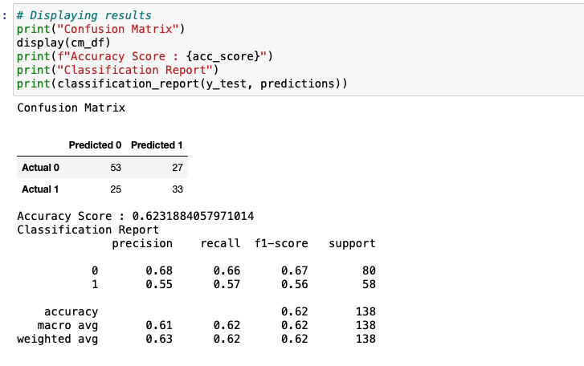

## Overview 

Using the bestseller-sample dataset as the initial input data, this project aims to determine if the economic changes affect the genre(s) of consumed media. Using the variables price, year, and UMCSEMT (University of Michigan Consumer Sentiment), the ML model objective is to predict the book's genre, fiction or non-fiction. Since we are using an input (features) to predict an output (genre media) and interpretability and accuracy are important, the Machine Learning Model selected is a Supervised Random Forest Model. 

## Results 

- Balanced accuracy score: 0.6231
- Precision score: non-fiction 0.68, fiction 0.55
- Recall score: non-fiction 0.66, fiction 0.57

## Summary 
Since the initial dataset contains less than 1,000 data points,  to improve our model prediction, additional data and features will be gathered, and additional supervised models will be evaluated. 
